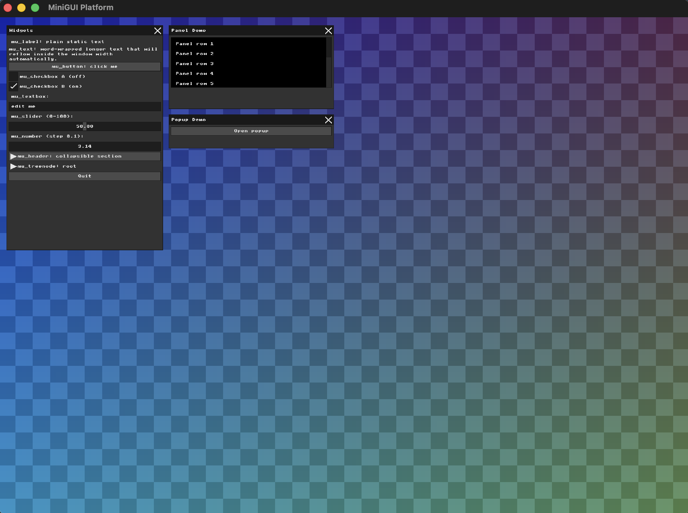
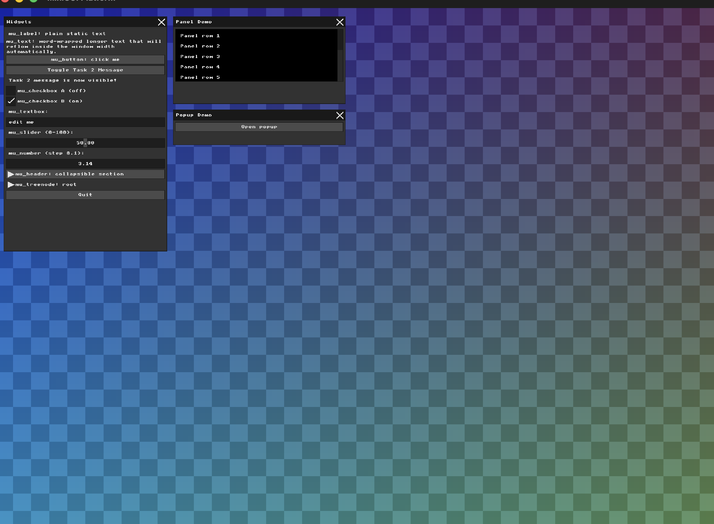
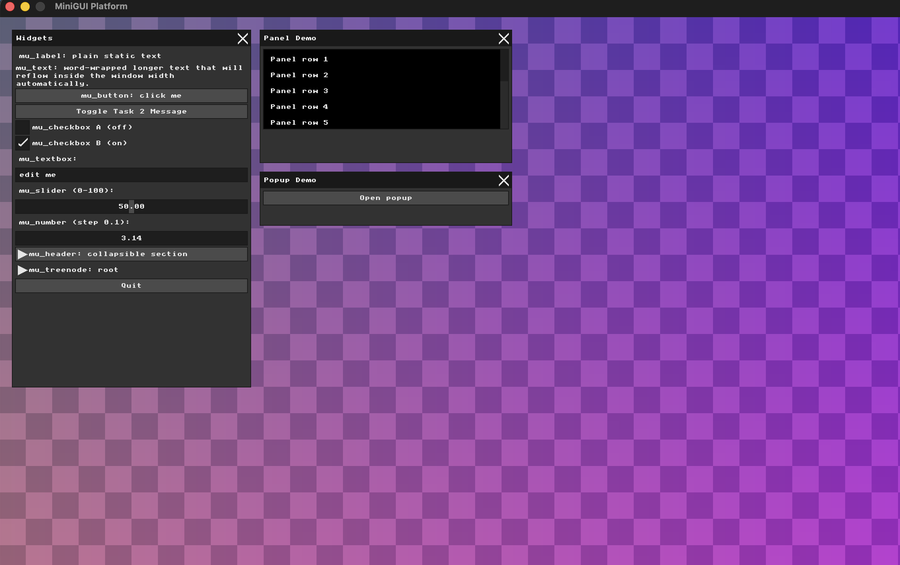
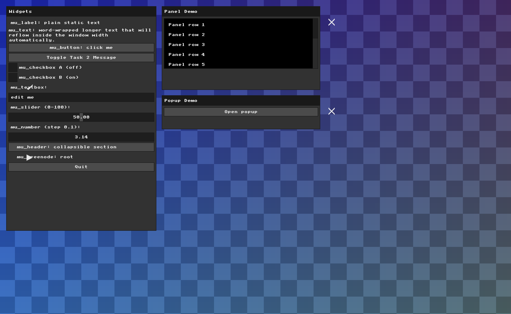

# HW1 Report
## Youssif Kenani – 212345532

---

# Task 1 – Framebuffer Background Pattern

## Goal
The goal of this task was to modify the raw framebuffer background by changing the RGB values of every pixel. Instead of using a simple solid color or a one-dimensional gradient, I created a two-dimensional background pattern using both the `x` and `y` pixel coordinates.

## Implementation
Inside `nanorender/src/main.cpp`, I modified the Scene Rendering loop.  
For each pixel, I calculated its `x` and `y` coordinates from the one-dimensional framebuffer index `i`.

First, I normalized the coordinates relative to the window size:

```cpp
float nx = (float)x / WIDTH;
float ny = (float)y / HEIGHT;
```

Then I generated a checker/grid pattern using integer division and modulo operations:

```cpp
int grid = ((x / 40) + (y / 40)) % 2;
```

Finally, I used these values to calculate the red, green, and blue channels:

```cpp  
uint8_t r = (uint8_t)(20 + 60 * nx + (grid ? 18 : 0));
uint8_t g = (uint8_t)(35 + 90 * ny + (grid ? 25 : 0));
uint8_t b = (uint8_t)(70 + 100 * (1.0f - nx) + (grid ? 30 : 0));
```

This produces a smooth two-dimensional gradient combined with a subtle checker-style pattern across the framebuffer.

## Result

The final result is a dark neon-style background rendered directly into the framebuffer. The pattern changes in both horizontal and vertical directions and creates a more visually interesting scene than a simple solid color.



## Notes

This task helped me better understand how a framebuffer works as a one-dimensional array and how 2D pixel coordinates can be transformed into color values for rendering graphical patterns.


# Task 2 – Immediate Mode UI Widget

## Goal
The goal of this task was to add a new interactive MicroUI widget and demonstrate how Immediate Mode UI uses external state.

## Implementation
Inside `nanorender/src/main.cpp`, I added a new button inside the `mu_begin(ctx)` UI block. The button toggles a static boolean variable and prints a message to the console when clicked.

```cpp
static bool show_message = false;

mu_layout_row(ctx, 1, w1, 0);
if (mu_button(ctx, "Toggle Task 2 Message")) {
  show_message = !show_message;
  printf("Task 2 button clicked!\n");
}

if (show_message) {
  mu_layout_row(ctx, 1, w1, 0);
  mu_label(ctx, "Task 2 message is now visible!");
}
```
# Result

Clicking the button toggles a text label inside the MicroUI window.
The button also prints a message to the console when clicked.



# Notes

This task helped me understand that in Immediate Mode UI, widgets are declared every frame, while persistent state must be stored externally.


# Task 3 – Real-Time Input Handling and Visual Effects

## Goal
The goal of this task was to intercept keyboard input using the MiniFB character input callback and dynamically modify the application's visual appearance in real time.

## Implementation
Inside `nanorender/src/main.cpp`, I added a global boolean variable to store the current background mode:

```cpp
static bool g_alt_background = false;
```

Then I modified the `mfb_set_char_input_callback` function to detect when the user presses the `B` key.

```cpp
if (c == 'b' || c == 'B') {
  g_alt_background = !g_alt_background;
  printf("Background effect toggled: %s\n",
         g_alt_background ? "ON" : "OFF");
  return;
}
```

When the `B` key is pressed, the callback toggles the background state variable and consumes the event so it is not forwarded to the UI system.

Inside the framebuffer rendering loop, I used the value of `g_alt_background` to switch between two different color schemes:

```cpp
if (g_alt_background) {
  r = (uint8_t)(90 + 100 * ny + (grid ? 35 : 0));
  g = (uint8_t)(25 + 70 * (1.0f - nx) + (grid ? 20 : 0));
  b = (uint8_t)(120 + 80 * nx + (grid ? 25 : 0));
} else {
  r = (uint8_t)(20 + 60 * nx + (grid ? 18 : 0));
  g = (uint8_t)(35 + 90 * ny + (grid ? 25 : 0));
  b = (uint8_t)(70 + 100 * (1.0f - nx) + (grid ? 30 : 0));
}
```

This creates a real-time visual effect that changes instantly when the user presses the keyboard shortcut.

## Result

Pressing the `B` key dynamically toggles between two different framebuffer background styles while the application is running.



## Notes

This task helped me understand how callbacks are used to capture operating system input events and synchronize them with the rendering loop. It also demonstrated how Immediate Mode applications manage interaction state externally.


# Task 4 – UI Renderer Transformation and Interaction Offset

## Goal
The goal of this task was to modify the rendering layer of the UI system and demonstrate the separation between logical UI interaction and visual rendering.

## Implementation
Inside `nanorender/src/ui_renderer.cpp`, I modified the `draw_pixel` function to apply a visual offset before writing pixels into the framebuffer.

Originally, pixels were drawn directly using the original coordinates:

```cpp
m_buffer[y * m_width + x] = c;
```

I changed the rendering coordinates by introducing an offset:

```cpp
int visual_x = x + 40;
int visual_y = y + 25;
```

Then I used these shifted coordinates when writing to the framebuffer:

```cpp
m_buffer[visual_y * m_width + visual_x] = c;
```

This transformation shifts the entire rendered UI 40 pixels to the right and 25 pixels downward.

## Result

The UI is visually displayed in a shifted position on the screen. However, the clickable interaction areas remain at their original logical positions.

As a result:
- Clicking directly on the visible button no longer works correctly.
- To successfully activate a button, the mouse cursor must be placed approximately 40 pixels left and 25 pixels above the visible rendered button.



## Explanation

This behavior occurs because MicroUI calculates input handling and widget hitboxes independently from the renderer. The renderer only controls how the UI is visually drawn to the framebuffer, while the interaction system still uses the original unshifted coordinates.

This task demonstrated the architectural separation between:
- UI state and interaction logic
- low-level visual rendering

## Notes

This task helped me understand how rendering systems and input systems can operate independently inside a graphics/UI framework.